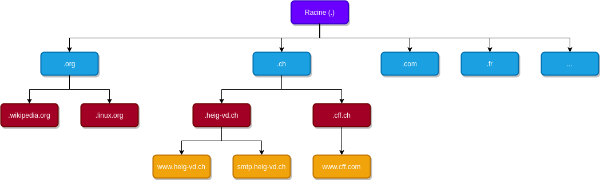

# DNS

DNS est un service de 

> **Traduction de noms de domaines en adresses IP**

#### **Fonctions:**

* Définition d'alias
  * Par exemple smtp.gmail.com au lieu de gmail-smtp-msa.l.google.com
* Recherche du serveur mail pour une adresse e-mail
  * Par exemple bill@hotmail.com→Serveur mail mx1.hotmail.com
* Répartition de charge
  * Les sites comme www.google.com utilisent plusieurs serveurs
  * DNS permet de répartir facilement la charge sur les serveurs

## Espace des noms de domaine

* Les noms de domaines identifient des domaines, sous-domaines, sous-sous-domaines, ..., jusqu’aux hôtes individuels
* Organisés en arborescence
  * Un nom de domaine est donné par la concaténation des labels depuis la feuille à la racine séparés par des points
* Syntaxe
  * Non sensible à la casse
  * Maximum 255 caractères
  * Maximum 63 caractères par label



## Enregistrements de ressources

A chaque nœud de l’espaces des noms de domaine on peut associer un ensemble d’enregistrement de ressources \(**Ressource Records, RR**\). Le plus souvent, le RR contient l’adresse IP d’un hôte, mais d’autres informations sont possibles


#### Format d'un RR

* **Durée de vie**: durée maximum en secondes pour garder une copie \(typiquement entre 1-60 jours\)
* **Classe**: contient IN pour Internet
* **Type**: type de l'enregistrement
* **Valeur** : valeur associée au RR

## Principaux types d’enregistrement

| Type | Signification | Valeur |
| :--- | :--- | :--- |
| **A** | Adresse IPv4 | Par exemple 193.134.220.23 |
| **AAAA** | Adresse IPv6 | Par exemple 2a00:1450:4002:803::1017 |
| **CNAME** | Canonical Name | Nom canonique d’un serveur pour un alias donné. Par exemple gmail-smtp-msa.l.google.com pour smtp.gmail.com |
| **MX** | Mail exchange | Nom canonique du serveur de messagerie pour ce domaine. Par exemple mailcl1.heig-vd.ch pour heig-vd.ch |
| **NS** | Name server | Nom du serveur DNS responsable pour un domaine. Par exemple dnsext02.heig-vd.ch pour heig-vd.ch |
| **TXT** | Text | Texte ASCII arbitraire |
| **PTR** | Pointer | Nom de domaine pour une adresse IP. Pour la résolution inverse. Par exemple www.heig-vd.ch pour 23.220.134.193.in-addr.arpa |
| **SOA** | Start Of Authorithy | Serveur principal, courriel de contact et d’autres informations concernant la zone de ce domaine |

#### Exemple

```text
dig cs.vu.nl ANY
```


