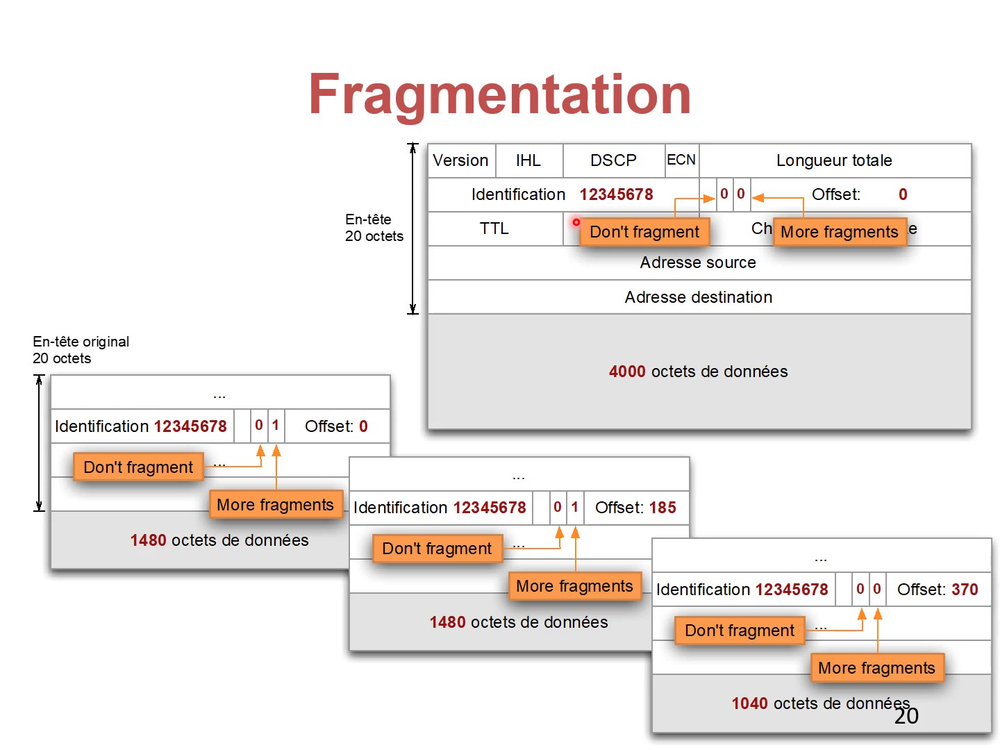

# Datagramme IP

## Service offert par IP

#### Transmission sans connexion

* Aucun établissement de connexion avant l’envoi des données
* Un paquet \(appelé « datagramme IP »\) contient toutes les informations nécessaires à son traitement
* Une source peut envoyer des données à tout moment, sans connexion préalable

#### Service non fiable « Best Effort »

* IP essaie au mieux de transmettre les paquets, mais ne garantit rien
* Les paquets peuvent être perdus, arriver en désordre, arriver en retard
* Le routeur place les paquets dans une file d’attente
* La file d’attente entraîne des retards variables
* Si la file d’attente déborde, le paquet est perdu
* IP ne donne donc pas de garantie quant aux délais, pertes, ordre des paquets

#### Fragmentation et réassemblage

* Une source de paquets ne connaît pas le chemin emprunté, ni les technologies sous-jacentes. Elle ne peut pas anticiper la taille de paquet maximum possible
* Les routeurs intermédiaires peuvent fragmenter un datagramme en plusieurs fragments plus petits
* Si le datagramme est trop grand pour l’interface, le routeur le fragmente et transmet les fragments séparément
* Le destinataire final réassemble le datagramme originale

## Format des datagrammes

<table>
  <thead>
    <tr>
      <th style="text-align:left">Intitul&#xE9;</th>
      <th style="text-align:left">Nombre de bits</th>
      <th style="text-align:left">Fonction</th>
    </tr>
  </thead>
  <tbody>
    <tr>
      <td style="text-align:left">Version</td>
      <td style="text-align:left">4</td>
      <td style="text-align:left">
        <ul>
          <li>Indique la version IPV4 / IPV6</li>
        </ul>
      </td>
    </tr>
    <tr>
      <td style="text-align:left">IHL</td>
      <td style="text-align:left">4</td>
      <td style="text-align:left">
        <ul>
          <li>Internet Header Length</li>
          <li>Longueur de l&#x2019;en-t&#xEA;te</li>
          <li>N&#xE9;cessaire &#xE0; cause des options</li>
          <li>En multiples de 4 octets &#x2013; IHL = 5 &#x2192; 20 octets</li>
          <li>L&#x2019;en-t&#xEA;te a une longueur de 20 &#x2013; 60 octets</li>
        </ul>
      </td>
    </tr>
    <tr>
      <td style="text-align:left">DSCP</td>
      <td style="text-align:left">6</td>
      <td style="text-align:left">
        <ul>
          <li>Rarement utilis&#xE9;</li>
          <li>Permet de d&#xE9;finir des qualit&#xE9;s de service</li>
          <li>Exemple : service avec d&#xE9;bit garanti</li>
        </ul>
      </td>
    </tr>
    <tr>
      <td style="text-align:left">ECN</td>
      <td style="text-align:left">2</td>
      <td style="text-align:left">
        <ul>
          <li>Explicit congestion notification</li>
          <li>Extension r&#xE9;cente et avanc&#xE9;e qui permet aux routeurs de signaler
            une congestion &#xE0; une source</li>
          <li>Cette fonction est de plus en plus utilis&#xE9; par les OS</li>
        </ul>
      </td>
    </tr>
    <tr>
      <td style="text-align:left">Longueur totale</td>
      <td style="text-align:left">16</td>
      <td style="text-align:left">
        <ul>
          <li>Indique la longueur totale du datagramme, en octets</li>
          <li>Longueur maximale : 65&#x2019;535 octets</li>
        </ul>
      </td>
    </tr>
    <tr>
      <td style="text-align:left">Identification</td>
      <td style="text-align:left">16</td>
      <td style="text-align:left">
        <ul>
          <li>Utilis&#xE9;s pour la fragmentation et le r&#xE9;assemblage de datagrammes</li>
        </ul>
      </td>
    </tr>
    <tr>
      <td style="text-align:left">Flags + offset de fragmentation</td>
      <td style="text-align:left">3</td>
      <td style="text-align:left">
        <ul>
          <li>Utilis&#xE9;s pour la fragmentation et le r&#xE9;assemblage de datagrammes</li>
        </ul>
      </td>
    </tr>
    <tr>
      <td style="text-align:left">TTL</td>
      <td style="text-align:left">8</td>
      <td style="text-align:left">
        <ul>
          <li>Time-to-live</li>
          <li>Permet d&#x2019;&#xE9;liminer des paquets pris dans une boucle de routage</li>
          <li>Le champ est d&#xE9;cr&#xE9;ment&#xE9; par chaque routeur</li>
          <li>Le paquet est &#xE9;limin&#xE9; si le compteur atteint 0</li>
        </ul>
      </td>
    </tr>
    <tr>
      <td style="text-align:left">Protocole</td>
      <td style="text-align:left">8</td>
      <td style="text-align:left">
        <ul>
          <li>Indique le protocole de la couche sup&#xE9;rieure</li>
          <li>Indique &#xE0; qui IP doit passer les donn&#xE9;es du paquet</li>
        </ul>
      </td>
    </tr>
    <tr>
      <td style="text-align:left">Checksum de l&#x2019;en-t&#xEA;te</td>
      <td style="text-align:left">16</td>
      <td style="text-align:left">
        <ul>
          <li>Somme de contr&#xF4;le qui peut d&#xE9;tecter des erreurs de bit dans
            l&#x2019;en-t&#xEA;te (pas dans les donn&#xE9;es)</li>
          <li>Chaque routeur la v&#xE9;rifie et &#xE9;carte les paquets erron&#xE9;s</li>
          <li>Comme le TTL change &#xE0; chaque saut, chaque routeur doit mettre &#xE0;
            jour cette somme de contr&#xF4;le</li>
        </ul>
      </td>
    </tr>
    <tr>
      <td style="text-align:left">Adresse source</td>
      <td style="text-align:left">32</td>
      <td style="text-align:left">Adresses IPv4 des terminaux sur 32 bits</td>
    </tr>
    <tr>
      <td style="text-align:left">Adresse destination</td>
      <td style="text-align:left">32</td>
      <td style="text-align:left">Adresses IPv4 des terminaux sur 32 bits</td>
    </tr>
    <tr>
      <td style="text-align:left">Options</td>
      <td style="text-align:left">variable</td>
      <td style="text-align:left">
        <ul>
          <li>Rarement utilis&#xE9;es</li>
          <li>Par exemple options de routage, s&#xE9;curit&#xE9;</li>
        </ul>
      </td>
    </tr>
    <tr>
      <td style="text-align:left">Bourrage</td>
      <td style="text-align:left">variable</td>
      <td style="text-align:left">
        <ul>
          <li>La longueur de l&#x2019;en-t&#xEA;te doit &#xEA;tre un multiple de 4 octets</li>
          <li>Si n&#xE9;cessaire, le bourrage rallonge l&#x2019;en-t&#xEA;te de 1-3
            octets</li>
        </ul>
      </td>
    </tr>
  </tbody>
</table>

## Fragmentation

* Un routeur \(ou la source\) fragmente un datagramme s’il est trop long pour l’interface
  * Ethernet: 1500 octets
  * WLAN: 7981 octets
* Chaque fragment est un datagramme complet
  * Les fragments sont acheminés de manière indépendante
  * Ils peuvent être fragmentés de nouveau plus loin
* Le destinataire doit réassembler les fragments
  * Les fragments peuvent arriver en désordre
  * Si un fragment est perdu, le datagramme sera supprimé

#### Identification

* Identificateur unique d’un datagramme
* Permet de reconnaître les fragments 

#### Flags

* DF: Don’t fragment
  * Mis par la source
  * Empêche la fragmentation
* MF: More fragments
  * 0 pour le dernier fragment, sinon 1

#### Offset

* Position du fragment dans le datagramme
* En multiples de 8 octets

