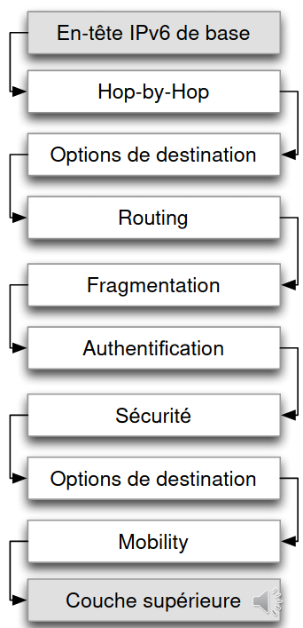

# Structure d'IPv6

Comme les adresses IPv4, les adresses IPv6 ont deux parties:

1. Préfixe de réseau: 64 bits
2. Identificateur de machine: 64 bits

## En-tête IPv6

L’en-tête de base, utilisé dans la majorité des paquets a été simplifié

* Les champs rarement utilisés peuvent être ajoutés à l’aide d’en-têtes d’extension
* L’en-tête de base a une longueur fixe. Le champ «Header length» n’est plus nécessaire
* La somme de contrôle est éliminée pour des raisons d’efficacité.

#### Classe de trafic \(8 bit\)

Permet d’introduire des services différenciés

#### Identificateur de flux \(20 bit\)

Permettra à l’avenir le traitement plus efficace de flux de paquets

#### Longueur des données \(16 bit\)

* Longueur maximale en mode normale: 65’535 octets
* Option ‘Jumbogrammes’ pour datagrammes plus longs

#### En-tête suivant \(8 bit\)

* Indique le type de l’en-tête qui suit \(extension ou couche supérieure\)

#### Nombre de sauts

* Similaire à TTL en IPv4

## En-têtes d'extension

* Les en-têtes d’extension permettent d’évoluer le protocole IPv6 et d’implémenter des fonctionnalités supplémentaires
* Ils sont **examinés uniquement par le destinataire final** \(sauf en-tête ‘Hop-by-Hop’\)
* Ils peuvent être chaînés à l’aide du champ ‘En-tête suivant’ dans chaque en-tête.
* La grande majorité des datagrammes ne contiennent pas d’extensions. Ils n’ont que l’en-tête IPv6 de base suivi de l’en-tête de la couche supérieur

