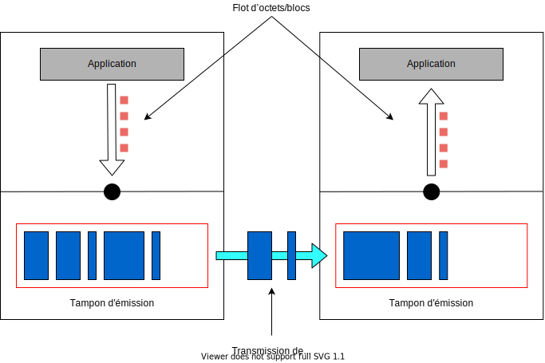

# Transfert tamponné à flot d'octets

TCP offre à la couche supérieure un service à **flot d’octets**.

1. L’application passe des blocs de données à TCP
2. TCP les met dans un **tampon d’émission**
3. TCP regroupe les données en **segments** à transmettre
4. Le récepteur TCP place les segments reçus dans un **tampon de réception**
5. L’application lit des blocs de données, sans tenir compte de segments


**La délimitation des messages de l’application n’est pas respectée.** On peut dire _« send\(data\) != recv\(data\) »_ : le données reçues ne correspondent pas aux données envoyées


